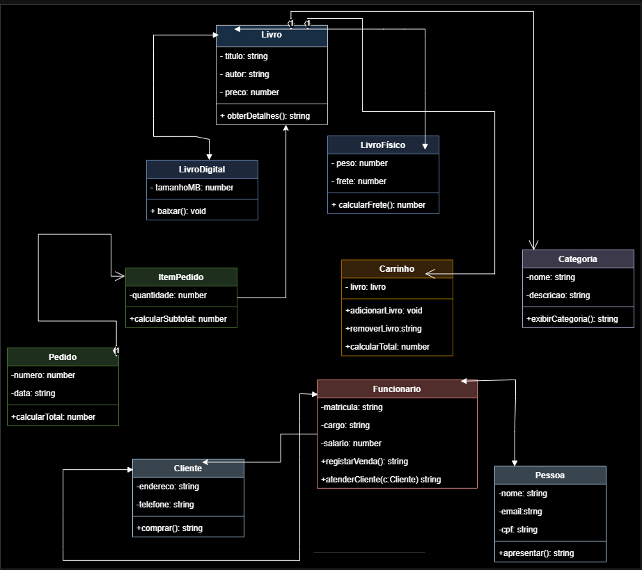

# API de Gestão da Livraria — Grupo Nº6

Projeto da UC de Programação Back-End — Curso Técnico em Desenvolvimento de Sistemas  
Escola SENAI "Santo Paschoal Crepaldi" — Turma 1-2026-SESI_DEV_OC_1

---

## 👥 Integrantes

* Nome Completo 1 — [@abreu010](https://github.com/abreu010)
* Nome Completo 2 — [@anasigole-jpg](https://github.com/anasigole-jpg)
* Nome Completo 3 — [@mariaesantos54-png](https://github.com/mariaesantos54-png)
* Leonardo Damasceno — [@leonardodamascenodev](https://github.com/leonardodamascenodev)

---

## 📋 Divisão de responsabilidades

| Bloco | Integrante | O que ficou sob responsabilidade dele(a) |
|---|---|---|
| Bloco 1 | Grupo Nº6 | Modelagem UML, atualização de atributos/métodos, validação dos 4 relacionamentos e multiplicidades. |
| Bloco 2 | Grupo Nº6 | Estruturação da arquitetura MVC (routes, controllers, services), auditoria de coerência UML x código e consolidação do modelo em `src/models/`. |
| Bloco 3 | Grupo Nº6 | Refatoração Clean Code, eliminação de números mágicos e divisão de métodos extensos. |

*Esta tabela é atualizada a cada bloco, com rodízio de responsabilidades entre os integrantes.*

---

## 📐 Diagrama UML Final

 <!-- Altere o caminho se sua imagem estiver em outro local -->

**Especificações do Diagrama:**
* Contém todas as classes do modelo com atributos, métodos, multiplicidades e os 4 tipos de relacionamentos (associação, agregação, composição e herança).
* As classes `Pedido` e `ItemPedido` constam apenas no diagrama UML como planejamento da arquitetura e serão implementadas em código futuramente.

---

## 🔍 Auditoria: UML x MVC (28/08/2026)

Comparação do diagrama de classes com os arquivos presentes na pasta `src/models/` do repositório:

| Classe do diagrama | Existe em src/models/? | Se não existe, por quê |
|---|---|---|
| Livro | Sim | Já consolidado em código no repositório. |
| Categoria | Sim | Já consolidado em código no repositório. |
| LivroFisico | Sim | Já consolidado em código no repositório. |
| LivroDigital | Sim | Já consolidado em código no repositório. |
| Pessoa | Sim | Já consolidado em código no repositório. |
| Cliente | Sim | Já consolidado em código no repositório. |
| Funcionario | Sim | Já consolidado em código no repositório. |
| Carrinho | Sim | Já consolidado em código no repositório. |
| Pedido | Não | Ainda não existe em código nenhum, foi desenhada para o Bloco 3. |
| ItemPedido | Não | Ainda não existe em código nenhum, foi desenhada para o Bloco 3. |

### Decisão do Grupo (Atividade do dia 28/08/2026)
* As classes `LivroFisico`, `LivroDigital`, `Carrinho`, `Pessoa`, `Cliente`, `Funcionario`, `Livro` e `Categoria` já se encontram devidamente consolidadas na pasta `src/models/` do repositório.
* As classes `Pedido` e `ItemPedido` permanecem apenas no diagrama UML e serão desenvolvidas no Bloco 3, quando a integração com o banco de dados for realizada.

---

## 📁 Estrutura de Pastas (Esqueleto MVC)

```text
livraria-api-grupo6/
├── docs/
│   └── diagrama-uml.png
├── src/
│   ├── controllers/
│   │   ├── LivroController.js
│   │   └── CategoriaController.js
│   ├── models/
│   │   ├── Livro.js
│   │   ├── Categoria.js
│   │   ├── LivroFisico.js
│   │   ├── LivroDigital.js
│   │   ├── Pessoa.js
│   │   ├── Cliente.js
│   │   ├── Funcionario.js
│   │   └── Carrinho.js
│   ├── routes/
│   │   ├── livroRoutes.js
│   │   └── categoriaRoutes.js
│   ├── services/
│   │   ├── LivroService.js
│   │   └── CategoriaService.js
│   └── server.js (ou app.js)
├── package.json
└── README.md
